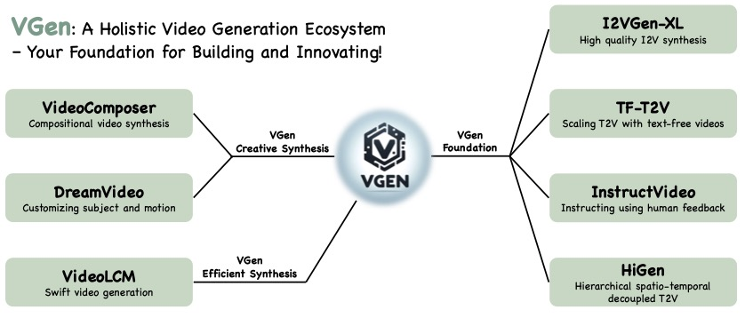

# VGen




VGen is an open-source video synthesis codebase developed by the Tongyi Lab of Alibaba Group, featuring state-of-the-art video generative models. This repository includes implementations of the following methods:


- [I2VGen-xl: High-quality image-to-video synthesis via cascaded diffusion models](https://i2vgen-xl.github.io/)
- [VideoComposer: Compositional Video Synthesis with Motion Controllability](https://videocomposer.github.io/)
- [Hierarchical Spatio-temporal Decoupling for Text-to-Video Generation](https://higen-t2v.github.io/)
- [A Recipe for Scaling up Text-to-Video Generation with Text-free Videos]()
- [InstructVideo: Instructing Video Diffusion Models with Human Feedback]()
- [DreamVideo: Composing Your Dream Videos with Customized Subject and Motion](https://dreamvideo-t2v.github.io/)
- [VideoLCM: Video Latent Consistency Model](https://arxiv.org/abs/2312.09109)
- [Modelscope text-to-video technical report](https://arxiv.org/abs/2308.06571)


VGen can produce high-quality videos from the input text, images, desired motion, desired subjects, and even the feedback signals provided.  It also offers a variety of commonly used video generation tools such as visualization, sampling, training, inference, join training using images and videos, acceleration, and more. 


<a href='https://i2vgen-xl.github.io/'></a> <a href='https://arxiv.org/abs/2311.04145'></a> [](https://youtu.be/XUi0y7dxqEQ) <a href='https://cloud.video.taobao.com/play/u/null/p/1/e/6/t/1/441039979087.mp4'></a>


## 🔥News!!!
- __[2023.12]__ We release the diffusion based expressive talking head generation [DreamTalk](https://dreamtalk-project.github.io)
- __[2023.12]__ We release the high-efficiency video generation method [VideoLCM](https://arxiv.org/abs/2312.09109)
- __[2023.12]__ We release the code and model of [I2VGen-XL](https://i2vgen-xl.github.io) and the [ModelScope T2V](https://arxiv.org/abs/2308.06571)
- __[2023.12]__ We release the T2V method [HiGen](https://higen-t2v.github.io) and customizing T2V method [DreamVideo](https://dreamvideo-t2v.github.io).
- __[2023.12]__ We write an [introduction document](doc/introduction.pdf) for VGen and compare I2VGen-XL with SVD.
- __[2023.11]__ We release a high-quality I2VGen-XL model, please refer to the [Webpage](https://i2vgen-xl.github.io)


## TODO
- [x] Release the technical papers and webpage of [I2VGen-XL](doc/i2vgen-xl.md)
- [x] Release the code and pretrained models that can generate 1280x720 videos
- [ ] Release models optimized specifically for the human body and faces
- [ ] Updated version can fully maintain the ID and capture large and accurate motions simultaneously
- [ ] Release other methods and the corresponding models


## Preparation

The main features of VGen are as follows:
- Expandability, allowing for easy management of your own experiments.
- Completeness, encompassing all common components for video generation.
- Excellent performance, featuring powerful pre-trained models in multiple tasks.


### Installation

```
conda create -n vgen python=3.8
conda activate vgen
pip install torch==1.12.0+cu113 torchvision==0.13.0+cu113 torchaudio==0.12.0 --extra-index-url https://download.pytorch.org/whl/cu113
pip install -r requirements.txt -i https://pypi.tuna.tsinghua.edu.cn/simple
```

You  also need to ensure that your system has installed the `ffmpeg` command. If it is not installed, you can install it using the following command:
```
sudo apt-get update && apt-get install ffmpeg libsm6 libxext6  -y
```


### Datasets

We have provided a **demo dataset** that includes images and videos, along with their lists in ``data``. 

*Please note that the demo images used here are for testing purposes and were not included in the training.*


### Clone codeb

```
git clone https://github.com/damo-vilab/i2vgen-xl.git
cd i2vgen-xl
```


## Getting Started with VGen

### (1) Train your text-to-video model


Executing the following command to enable distributed training is as easy as that.
```
python train_net.py --cfg configs/t2v_train.yaml
```

In the `t2v_train.yaml` configuration file, you can specify the data, adjust the video-to-image ratio using `frame_lens`, and validate your ideas with different Diffusion settings, and so on.

- Before the training, you can download any of our open-source models for initialization. Our codebase supports custom initialization and `grad_scale` settings, all of which are included in the `Pretrain` item in yaml file.
- During the training, you can view the saved models and intermediate inference results in the `workspace/experiments/t2v_train`directory.

After the training is completed, you can perform inference on the model using the following command.
```
python inference.py --cfg configs/t2v_infer.yaml
```
Then you can find the videos you generated in the `workspace/experiments/test_img_01` directory. For specific configurations such as data, models, seed, etc., please refer to the `t2v_infer.yaml` file.

<!-- <table>
<center>
  <tr>
    <td ><center>
      <video muted="true" autoplay="true" loop="true" height="260" src="https://cloud.video.taobao.com/play/u/null/p/1/e/6/t/1/441754174077.mp4"></video>	
    </center></td>
    <td ><center>
      <video muted="true" autoplay="true" loop="true" height="260" src="https://cloud.video.taobao.com/play/u/null/p/1/e/6/t/1/441138824052.mp4"></video>	
    </center></td>
  </tr>
</center>
</table>
</center> -->

<table>
<center>
  <tr>
    <td ><center>
      <image  height="260" src="https://img.alicdn.com/imgextra/i4/O1CN01Ya2I5I25utrJwJ9Jf_!!6000000007587-2-tps-1280-720.png"></image>	
    </center></td>
    <td ><center>
      <image height="260" src="https://img.alicdn.com/imgextra/i3/O1CN01CrmYaz1zXBetmg3dd_!!6000000006723-2-tps-1280-720.png"></image>	
    </center></td>
  </tr>
  <tr>
    <td ><center>
      <p>Click <a href="https://cloud.video.taobao.com/play/u/null/p/1/e/6/t/1/441754174077.mp4">HERE</a> to view the generated video.</p>
    </center></td>
    <td ><center>
      <p>Click <a href="https://cloud.video.taobao.com/play/u/null/p/1/e/6/t/1/441138824052.mp4">HERE</a> to view the generated video.</p>
    </center></td>
  </tr>
</center>
</table>
</center>


### (2) Run the I2VGen-XL model

(i) Download model and test data:
```
!pip install modelscope
from modelscope.hub.snapshot_download import snapshot_download
model_dir = snapshot_download('damo/I2VGen-XL', cache_dir='models/', revision='v1.0.0')
```

or you can also download it through HuggingFace (https://huggingface.co/damo-vilab/i2vgen-xl):
```
# Make sure you have git-lfs installed (https://git-lfs.com)
git lfs install
git clone https://huggingface.co/damo-vilab/i2vgen-xl
```


(ii) Run the following command:
```
python inference.py --cfg configs/i2vgen_xl_infer.yaml
```
or you can run:
```
python inference.py --cfg configs/i2vgen_xl_infer.yaml  test_list_path data/test_list_for_i2vgen.txt test_model models/i2vgen_xl_00854500.pth
```
The `test_list_path` represents the input image path and its corresponding caption. Please refer to the specific format and suggestions within demo file `data/test_list_for_i2vgen.txt`. `test_model` is the path for loading the model. In a few minutes, you can retrieve the high-definition video you wish to create from the `workspace/experiments/test_list_for_i2vgen` directory. At present, we find that the current model performs inadequately on **anime images** and **images with a black background** due to the lack of relevant training data. We are consistently working to optimize it.


<span style="color:red">Due to the compression of our video quality in GIF format, please click 'HERE' below to view the original video.</span>

<center>
<table>
<center>
  <tr>
    <td ><center>
      <image  height="260" src="https://img.alicdn.com/imgextra/i1/O1CN01CCEq7K1ZeLpNQqrWu_!!6000000003219-0-tps-1280-720.jpg"></image>	
    </center></td>
    <td ><center>
      <!-- <video muted="true" autoplay="true" loop="true" height="260" src="https://cloud.video.taobao.com/play/u/null/p/1/e/6/t/1/442125067544.mp4"></video>	 -->
      <image  height="260" src="https://img.alicdn.com/imgextra/i4/O1CN01hIQcvG1spmQMLqBo0_!!6000000005816-1-tps-1280-704.gif"></image>	
    </center></td>
  </tr> 
  <tr>
    <td ><center>
      <p>Input Image</p>
    </center></td>
    <td ><center>
      <p>Click <a href="https://cloud.video.taobao.com/play/u/null/p/1/e/6/t/1/442125067544.mp4">HERE</a> to view the generated video.</p>
    </center></td>
  </tr> 
  <tr>
    <td ><center>
      <image  height="260" src="https://img.alicdn.com/imgextra/i4/O1CN01ZXY7UN23K8q4oQ3uG_!!6000000007236-2-tps-1280-720.png"></image>	
    </center></td>
    <td ><center>
      <!-- <video muted="true" autoplay="true" loop="true" height="260" src="https://cloud.video.taobao.com/play/u/null/p/1/e/6/t/1/441385957074.mp4"></video>	 -->
      <image height="260" src="https://img.alicdn.com/imgextra/i1/O1CN01iaSiiv1aJZURUEY53_!!6000000003309-1-tps-1280-704.gif"></image>	
    </center></td>
  </tr>
  <tr>
    <td ><center>
      <p>Input Image</p>
    </center></td>
    <td ><center>
      <p>Click <a href="https://cloud.video.taobao.com/play/u/null/p/1/e/6/t/1/441385957074.mp4">HERE</a> to view the generated video.</p>
    </center></td>
  </tr> 
  <tr>
    <td ><center>
      <image  height="260" src="https://img.alicdn.com/imgextra/i3/O1CN01NHpVGl1oat4H54Hjf_!!6000000005242-2-tps-1280-720.png"></image>	
    </center></td>
    <td ><center>
      <!-- <video muted="true" autoplay="true" loop="true" height="260" src="https://cloud.video.taobao.com/play/u/null/p/1/e/6/t/1/442102706767.mp4"></video>	 -->
      <!-- <image muted="true" height="260" src="https://img.alicdn.com/imgextra/i4/O1CN01DgLj1T240jfpzKoaQ_!!6000000007329-1-tps-1280-704.gif"></image>	
       -->
      <image  height="260" src="https://img.alicdn.com/imgextra/i4/O1CN01DgLj1T240jfpzKoaQ_!!6000000007329-1-tps-1280-704.gif"></image>
    </center></td>
  </tr> 
  <tr>
    <td ><center>
      <p>Input Image</p>
    </center></td>
    <td ><center>
      <p>Click <a href="https://cloud.video.taobao.com/play/u/null/p/1/e/6/t/1/442102706767.mp4">HERE</a> to view the generated video.</p>
    </center></td>
  </tr> 
  <tr>
    <td ><center>
      <image height="260" src="https://img.alicdn.com/imgextra/i1/O1CN01odS61s1WW9tXen21S_!!6000000002795-0-tps-1280-720.jpg"></image>	
    </center></td>
    <td ><center>
      <!-- <video muted="true" autoplay="true" loop="true" height="260" src="https://cloud.video.taobao.com/play/u/null/p/1/e/6/t/1/442163934688.mp4"></video>	 -->
      <image height="260" src="https://img.alicdn.com/imgextra/i3/O1CN01Jyk1HT28JkZtpAtY6_!!6000000007912-1-tps-1280-704.gif"></image>	
    </center></td>
  </tr>
  <tr>
    <td ><center>
      <p>Input Image</p>
    </center></td>
    <td ><center>
      <p>Click <a href="https://cloud.video.taobao.com/play/u/null/p/1/e/6/t/1/442163934688.mp4">HERE</a> to view the generated video.</p>
    </center></td>
  </tr> 
</center>
</table>
</center>

### (3) Other methods

In preparation.


## Customize your own approach

Our codebase essentially supports all the commonly used components in video generation. You can manage your experiments flexibly by adding corresponding registration classes, including `ENGINE, MODEL, DATASETS, EMBEDDER, AUTO_ENCODER, VISUAL, DIFFUSION, PRETRAIN`, and can be compatible with all our open-source algorithms according to your own needs. If you have any questions, feel free to give us your feedback at any time.


## BibTeX

If this repo is useful to you, please cite our corresponding technical paper.


```bibtex
@article{2023i2vgenxl,
  title={I2VGen-XL: High-Quality Image-to-Video Synthesis via Cascaded Diffusion Models},
  author={Zhang, Shiwei and Wang, Jiayu and Zhang, Yingya and Zhao, Kang and Yuan, Hangjie and Qing, Zhiwu and Wang, Xiang  and Zhao, Deli and Zhou, Jingren},
  booktitle={arXiv preprint arXiv:2311.04145},
  year={2023}
}
@article{2023videocomposer,
  title={VideoComposer: Compositional Video Synthesis with Motion Controllability},
  author={Wang, Xiang and Yuan, Hangjie and Zhang, Shiwei and Chen, Dayou and Wang, Jiuniu, and Zhang, Yingya, and Shen, Yujun, and Zhao, Deli and Zhou, Jingren},
  booktitle={arXiv preprint arXiv:2306.02018},
  year={2023}
}
@article{wang2023modelscope,
  title={Modelscope text-to-video technical report},
  author={Wang, Jiuniu and Yuan, Hangjie and Chen, Dayou and Zhang, Yingya and Wang, Xiang and Zhang, Shiwei},
  journal={arXiv preprint arXiv:2308.06571},
  year={2023}
}
@article{dreamvideo,
  title={DreamVideo: Composing Your Dream Videos with Customized Subject and Motion},
  author={Wei, Yujie and Zhang, Shiwei and Qing, Zhiwu and Yuan, Hangjie and Liu, Zhiheng and Liu, Yu and Zhang, Yingya and Zhou, Jingren and Shan, Hongming},
  journal={arXiv preprint arXiv:2312.04433},
  year={2023}
}
@article{qing2023higen,
  title={Hierarchical Spatio-temporal Decoupling for Text-to-Video Generation},
  author={Qing, Zhiwu and Zhang, Shiwei and Wang, Jiayu and Wang, Xiang and Wei, Yujie and Zhang, Yingya and Gao, Changxin and Sang, Nong },
  journal={arXiv preprint arXiv:2312.04483},
  year={2023}
}
@article{wang2023videolcm,
  title={VideoLCM: Video Latent Consistency Model},
  author={Wang, Xiang and Zhang, Shiwei and Zhang, Han and Liu, Yu and Zhang, Yingya and Gao, Changxin and Sang, Nong },
  journal={arXiv preprint arXiv:2312.09109},
  year={2023}
}
@article{ma2023dreamtalk,
  title={DreamTalk: When Expressive Talking Head Generation Meets Diffusion Probabilistic Models},
  author={Ma, Yifeng and Zhang, Shiwei and Wang, Jiayu and Wang, Xiang and Zhang, Yingya and Deng Zhidong},
  journal={arXiv preprint arXiv:2312.09767},
  year={2023}
}
```


## Acknowledgement

We would like to express our gratitude for the contributions of several previous works to the development of VGen. This includes, but is not limited to [Composer](https://arxiv.org/abs/2302.09778), [ModelScopeT2V](https://modelscope.cn/models/damo/text-to-video-synthesis/summary), [Stable Diffusion](https://github.com/Stability-AI/stablediffusion), [OpenCLIP](https://github.com/mlfoundations/open_clip), [WebVid-10M](https://m-bain.github.io/webvid-dataset/), [LAION-400M](https://laion.ai/blog/laion-400-open-dataset/), [Pidinet](https://github.com/zhuoinoulu/pidinet) and [MiDaS](https://github.com/isl-org/MiDaS). We are committed to building upon these foundations in a way that respects their original contributions.


## Disclaimer

This open-source model is trained with using [WebVid-10M](https://m-bain.github.io/webvid-dataset/) and [LAION-400M](https://laion.ai/blog/laion-400-open-dataset/) datasets and is intended for <strong>RESEARCH/NON-COMMERCIAL USE ONLY</strong>. 