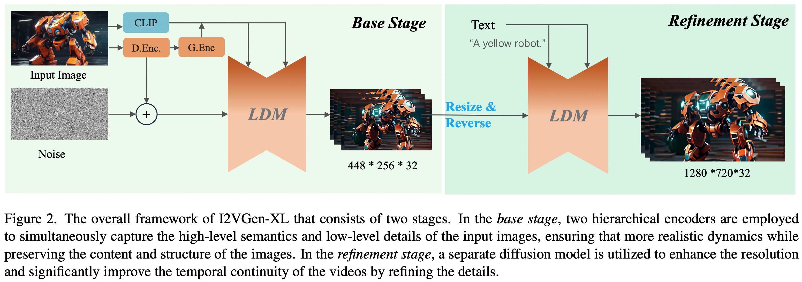
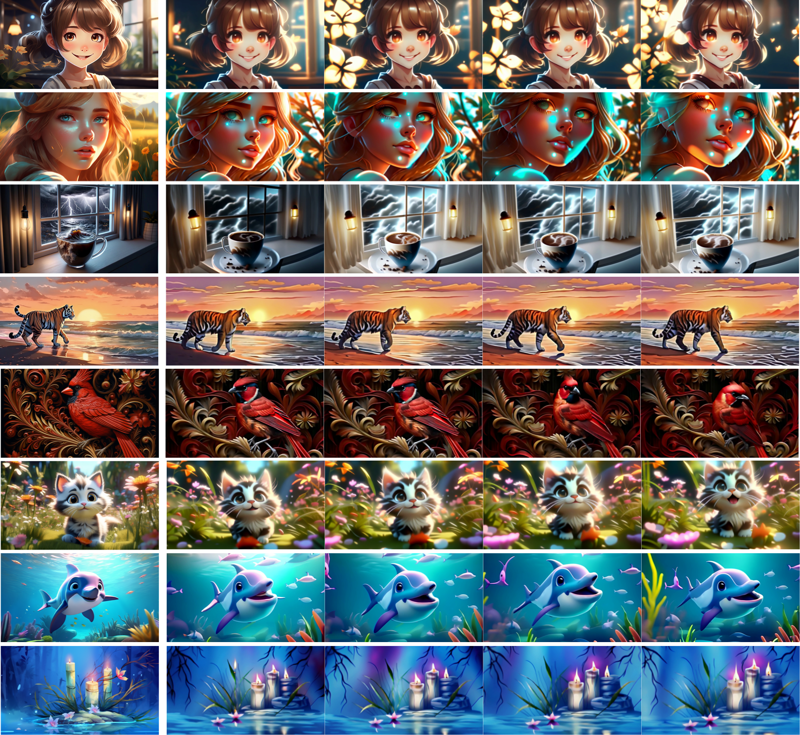

# I2VGen-XL

Official repo for [I2vgen-xl: High-quality image-to-video synthesis via cascaded diffusion models](https://arxiv.org/abs/2311.04145)

Please see [Project Page](https://i2vgen-xl.github.io) for more examples.

I2VGen-XL is capable of generating high-quality, realistically animated, and temporally coherent high-definition videos from a single input static image, based on user input.

*Our initial version has already been open-sourced on [Modelscope](https://modelscope.cn/models/damo/Image-to-Video/summary). This project focuses on improving the version, especially in terms of motions and semantics.*

## Examples

